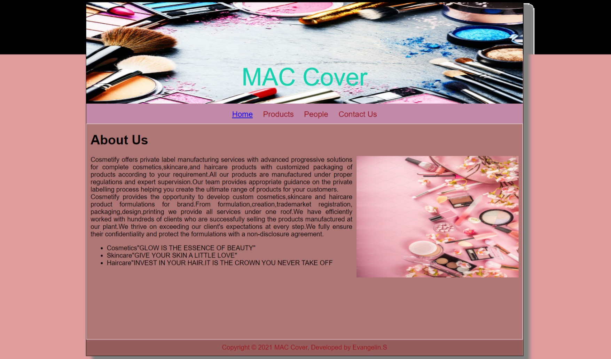
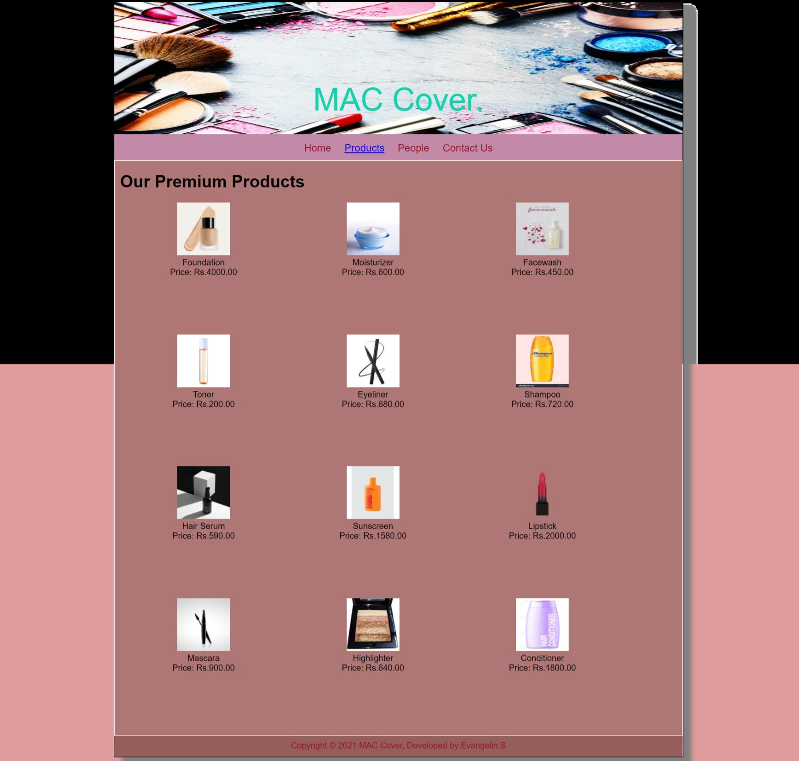
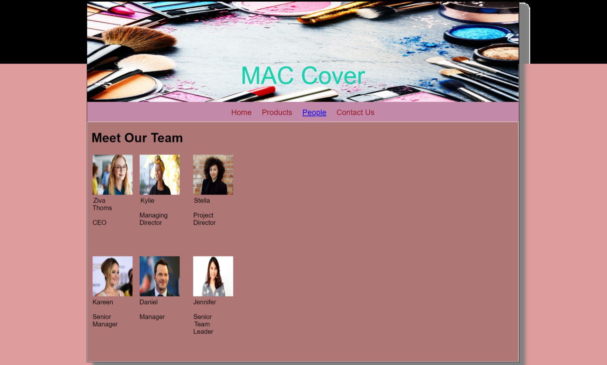
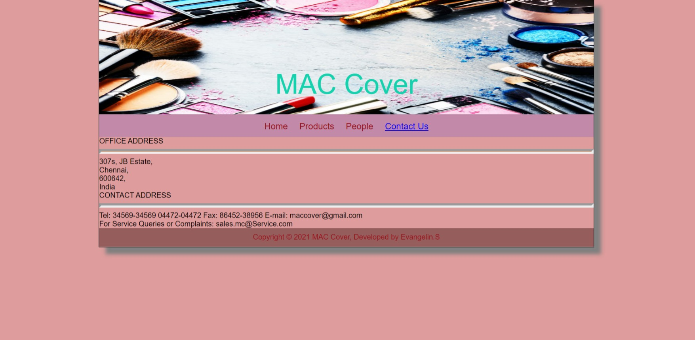

# Web Design for a Software Product Company

## AIM:

To design a static website for a software product company company.

## DESIGN STEPS:

### Step 1:

Requirement collection.

### Step 2:

Creating the layout using HTML and CSS.

### Step 3:

Updating the sample content.

### Step 4:

Choose the appropriate style and color scheme.

### Step 5:

Validate the layout in various browsers.

### Step 6:

Validate the HTML code.

### Step 6:

Publish the website in the given URL.

## PROGRAM :
## Home page code:
```<!DOCTYPE html>
<html lang="en">
  <head>
    <title>MAC Cover</title>
    <link rel="stylesheet" href="./css/layout.css" />
    <link rel="icon" href="./img/images.png" type="image/x-icon" />
  </head>

  <body>
    <div class="container">
      <div class="banner">MAC Cover</div>
      <div class="menu">
        <div class="menuitemselected"><a href="/static/home.html">Home</a></div>
        <div class="menuitem"><a href="/static/products.html">Products</a></div>
        <div class="menuitem"><a>People</a></div>
        <div class="menuitem"><a>Contact Us</a></div>
      </div>
      <div class="content">
        <div class="homecontent">
          <h1>About Us</h1>
          
          <div class="contenttext">
            Cosmetify offers private label manufacturing services
            with advanced progressive solutions for complete
            cosmetics,skincare,and haircare products with 
            customized packaging of products according to your
            requirement.All our products are manufactured under
            proper regulations and expert supervision.Our team 
            provides appropriate guidance on the private labelling 
            process helping you create the ultimate range of products 
            for your customers.            
            <br />
            Cosmetify provides the opportunity to develop custom
            cosmetics,skincare and haircare product formulations for 
            brand.From formulation,creation,trademarket registration,
            packaging,design,printing we provide all services under one 
            roof.We have efficiently worked with hundreds of clients 
            who are successfully selling the products manufactured at 
            our plant.We thrive on exceeding our client's expectations at
            every step.We fully ensure their confidentiality and protect 
            the formulations with a non-disclosure agreement.
            <ul>
              <li>Cosmetics"GLOW IS THE ESSENCE OF BEAUTY"</li>
              <li>Skincare"GIVE YOUR SKIN A LITTLE LOVE"</li>
              <li>Haircare"INVEST IN YOUR HAIR.IT IS THE CROWN YOU NEVER TAKE OFF</li>
            </ul>
          </div>
        </div>
      </div>
      <div class="footer">
        Copyright &#169; 2021 MAC Cover, Developed by Evangelin.S
      </div>
    </div>
  </body>
</html>
```
## Product page code:
```
<!DOCTYPE html>
<html lang="en">
  <head>
    <title>EduSoft Private Limited</title>
    <link rel="stylesheet" href="./css/layout.css" />
    <link rel="icon" href="./img/images.png" type="image/x-icon" />
  </head>

  <body>
    <div class="container">
      <div class="banner">MAC Cover.</div>
      <div class="menu">
        <div class="menuitem"><a href="/static/home.html">Home</a></div>
        <div class="menuitemselected">
          <a href="/static/products.html">Products</a>
        </div>
        <div class="menuitem"><a>People</a></div>
        <div class="menuitem"><a>Contact Us</a></div>
      </div>
      <div class="content">
        <div class="productcontent">    
          <h1>Our Premium Products</h1>
          <div class="productitems">
              <div class="productitem"> 
                  <div class="itemimage">
                  
                  </div>
                  <div class="itemname">Foundation</div>
                  <div class="itemprice">Price: Rs.4000.00 </div>
              </div>
              <div class="productitem"> 
                  <div class="itemimage">
                  
                  </div>
                  <div class="itemname">Moisturizer</div>
                  <div class="itemprice">Price: Rs.600.00 </div>
              </div>
              <div class="productitem"> 
                <div class="itemimage">
                
                </div>
                <div class="itemname">Facewash</div>
                <div class="itemprice">Price: Rs.450.00 </div>
            </div>
            <div class="productitem"> 
              <div class="itemimage">
              
              </div>
              <div class="itemname">Toner</div>
              <div class="itemprice">Price: Rs.200.00 </div>
          </div>
          <div class="productitem"> 
            <div class="itemimage">
            
            </div>
            <div class="itemname">Eyeliner</div>
            <div class="itemprice">Price: Rs.680.00 </div>
        </div>
        <div class="productitem"> 
          <div class="itemimage">
          
          </div>
          <div class="itemname">Shampoo</div>
          <div class="itemprice">Price: Rs.720.00 </div>
      </div>
      <div class="productitem"> 
        <div class="itemimage">
        
        </div>
        <div class="itemname">Hair Serum</div>
        <div class="itemprice">Price: Rs.590.00 </div>
    </div>
    <div class="productitem"> 
      <div class="itemimage">
      
      </div>
      <div class="itemname">Sunscreen</div>
      <div class="itemprice">Price: Rs.1580.00 </div>
  </div>
  <div class="productitem"> 
    <div class="itemimage">
    
    </div>
    <div class="itemname">Lipstick</div>
    <div class="itemprice">Price: Rs.2000.00 </div>
</div>

<div class="productitem"> 
  <div class="itemimage">
  
  </div>
  <div class="itemname">Mascara</div>
  <div class="itemprice">Price: Rs.900.00 </div>
</div>


<div class="productitem"> 
  <div class="itemimage">
  
  </div>
  <div class="itemname">Highlighter</div>
  <div class="itemprice">Price: Rs.640.00 </div>
</div>
<div class="productitem"> 
  <div class="itemimage">
  
  </div>
  <div class="itemname">Conditioner</div>
  <div class="itemprice">Price: Rs.1800.00 </div>
</div>
          </div>
          </div>        
      </div>
      <div class="footer">
        Copyright &#169; 2021 MAC Cover, Developed by Evangelin.S
      </div>
    </div>
  </body>
</html>
```
## People page code:
```<!DOCTYPE html>
<html lang="en">
  <head>
    <title>MAC Cover</title>
    <link rel="stylesheet" href="./css/layout.css" />
    <link rel="icon" href="./img/images.png" type="image/x-icon" />
  </head>

  <body>
    <div class="container">
      <div class="banner">MAC Cover</div>
      <div class="menu">
        <div class="menuitem"><a href="/static/home.html">Home</a></div>
        <div class="menuitem">
          <a href="/static/products.html">Products</a>
        </div>
        <div class="menuitemselected"><a href="/static/people.html">People</a></div>
        <div class="menuitem"><a>Contact Us</a></div>
      </div>
      <div class="content">
        <div class="productcontent">    
          <h1>Meet Our Team</h1>
          <table>
            <tr> 
            <td>
              <div class="productitem"> 
                  <div class="itemimage">
                  
                  </div>
                  <div class="itemname">Ziva Thoms </div> <br>
                  <div class="itemprice"> CEO  </div> 
                </td>
            <td>
                <div class="productitem"> 
                    <div class="itemimage">
                    
                    </div>
                    <div class="itemname"> Kylie </div> <br>
                    <div class="itemprice">Managing Director</div>
                </td>
                <td>
                    <div class="productitem"> 
                        <div class="itemimage">
                        
                        </div>
                        <div class="itemname">Stella</div> <br>
                        <div class="itemprice">Project Director</div>

                </td>  
            </tr>
            <tr>
                <td>
                    <div class="productitem"> 
                        <div class="itemimage">
                        
                        </div>
                        <div class="itemname">Kareen</div> <br>
                        <div class="itemprice">Senior Manager</div>
                    </td>
                    <td>
                        <div class="productitem"> 
                            <div class="itemimage">
                            
                            </div>
                            <div class="itemname">Daniel</div><br>
                            <div class="itemprice"> Manager</div>

                    </td>
                    <td>
                        <div class="productitem"> 
                            <div class="itemimage">
                            
                            </div>
                            <div class="itemname">Jennifer</div> <br>
                            <div class="itemprice">Senior Team Leader</div>
                    </td>

            </tr>    
            </table>
            </div>
            </div>
        </body>
        </html>
   ```
## Contact page code:
```
<!DOCTYPE html>
<html lang="en">
  <head>
    <title>MAC Cover</title>
    <link rel="stylesheet" href="./css/layout.css" />
    <link rel="icon" href="./img/images.png" type="image/x-icon" />
  </head>

  <body>
    <div class="container">
      <div class="banner">MAC Cover</div>
      <div class="menu">
        <div class="menuitem"><a href="/static/home.html">Home</a></div>
        <div class="menuitem">
          <a href="/static/products.html">Products</a>
        </div>
        <div class="menuitem"><a href="/static/people.html">People</a></div>
        <div class="menuitemselected"><a href="/static/contactus.html">Contact Us</a></div>
      </div>
      <div class="contactus" background-image="url(/static/img/cbg.jpg")>
          OFFICE ADDRESS <br>
          <hr style="height:2px;border-width:5px;color:#e6752f;background-color: #e6752f">
          
          307s, 
          JB Estate,<br>
          Chennai,<br>
          600642,<br>
          India<br>

          CONTACT ADDRESS<br>
          <hr style="height:2px;border-width:5px;color:#e6752f;background-color: #e6752f">
          
          Tel: 34569-34569
               04472-04472
          Fax: 86452-38956
          E-mail: maccover@gmail.com
          <br>
           For Service Queries or Complaints: sales.mc@Service.com
        
        </div>
        <div class="footer">
            Copyright &#169; 2021 MAC Cover, Developed by Evangelin.S
          </div>

      </div>
      </body>
      </html>
  ```   


## OUTPUT:

### Home Page:

### Product page:

### People page:

### Contact page:


## Result:

Thus a website is designed for the software product company and the HTML,CSS code are validated.
